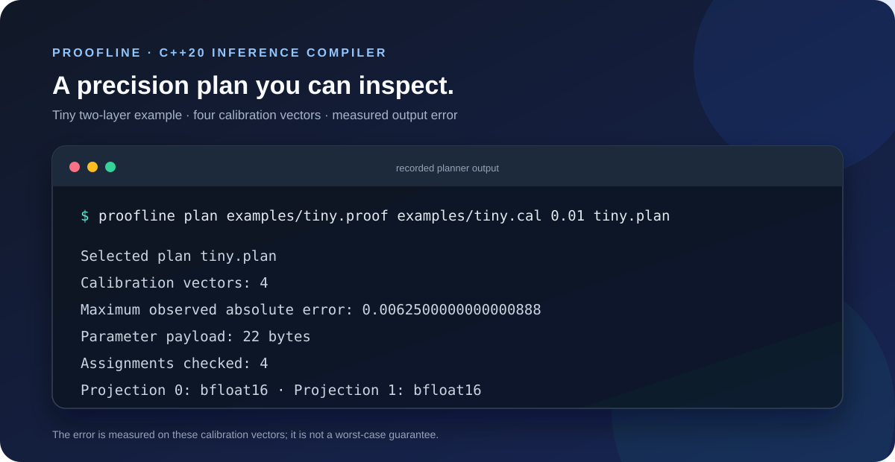

# Proofline

**A small C++ compiler lab for neural-network inference with precision choices you can inspect.**



The image shows the planner's recorded output for the included four-vector calibration example. Reproduce it with `scripts/verify_example.ps1` on Windows with Clang available on `PATH`.

Proofline is being built around a concrete research question: can a compiler choose a cheaper numeric format for each part of a model, generate a CPU program, and explain how much output error that choice permits?

The first target is deliberately narrow: feed-forward networks made from dense layers and ReLU. The model reader and CPU backend also include RMSNorm, stable vector Softmax, residual Add, fixed-position RoPE, token-wise Linear layers, and fixed-length multi-head self-attention with causal or full masking. This is a transformer building block, not yet a complete LLM compiler.

## The compiler path

```text
model description (`.proof`)
        ↓
shape-checked typed tensor graph
        ↓
per-layer f64/bfloat16 plan under observed-error limit
        ├──→ reference evaluator
        └──→ readable standalone C++20 source
```

The planner currently searches the f64/bfloat16 choices for each Dense or Linear projection and minimizes parameter payload while staying within an absolute output-error limit on a supplied calibration file. Attention currently uses f64 arithmetic. A selected plan can be reused by the reference evaluator and code generator; its measured error applies only to the calibration vectors. A separate `certify` command propagates intervals and floating-point roundoff bounds through a declared input box; its assumptions and limits are documented in [the compiler design](docs/COMPILER_DESIGN.md#bounded-domain-certificate). The planner's cost is parameter payload size, not runtime or whole-process memory.

## What is and is not established

Mixed-precision quantization, compiler optimization for neural networks, and formal analysis of quantized outputs all have substantial prior work. Proofline does not claim those ideas as inventions. The first focused review rejected the broad initial framing; the more specific reduction-scheduling question is still under review.

The current research hypothesis is narrower: select a BF16 Dense reduction schedule jointly with per-layer f64/BF16 choices, using measured CPU latency and an error bound for the emitted arithmetic. Prior work already covers sound mixed precision, bounded quantization error, code generation, and vectorization-aware tuning in overlapping combinations. The revised hypothesis remains unverified; see the [prior-art review](docs/PRIOR_ART.md).

## Source layout

The implementation is split across small C++ translation units so the main driver stays readable:

- `src/proofline.hpp` defines the shared model, graph, precision-plan, and tensor types.
- `src/attention_cache.hpp` and `src/attention_cache.cpp` implement the bounded append-only cache used by causal reference evaluation.
- `src/model.cpp` parses models and plans, builds and evaluates the graph, and searches precision plans.
- `src/certificate.cpp` contains bounded-domain error analysis and grid checking.
- `src/codegen.cpp` emits standalone C++ inference programs.
- `src/main.cpp` handles command-line parsing and connects the pieces.

For generated causal attention, the C++ source includes a layer-specific `AttentionSession_<layer>` class. `step(query, key, value)` retains K/V state between calls in reserved heap storage. When Q, K, and V each come directly from a Linear projection of the token input, `stepFromInput(token)` also runs those projections using the selected f64/BF16 plan. Other graph shapes use the projected-row API. The class provides `reset`, `size`, and `capacity`. Define `PROOFLINE_LIBRARY` before including the generated source to omit its command-line `main` and use the session in an embedding program.

## Current status

The working prototype reads and checks a model file, builds a branchable typed DAG, evaluates f64 and bfloat16 projection plans, and emits standalone C++20. Its rank-two path supports token-wise Linear, ReLU, residual Add, feature-wise RMSNorm, position-aware RoPE, and fixed-length multi-head self-attention with causal or full masking. The reference evaluator uses a bounded, append-only K/V cache for causal attention. Generated programs include a model-sized `AttentionSession_<layer>` class that retains cache state between calls; for direct Q/K/V Linear projections, `stepFromInput` performs those projections itself. The command-line path still runs the complete fixed-shape graph. Standalone Softmax remains vector-only. Bounded-domain certification remains limited to vector Dense/ReLU/Add graphs and explicitly refuses rank-two models. A complete Transformer block and production-grade independent review of the bound remain future work.

Build with CMake 3.20+ and a C++20 compiler:

```sh
cmake -S . -B build
cmake --build build --config Release
```

Inspect the included graph or run the reference evaluator:

```sh
./build/proofline inspect examples/tiny.proof
./build/proofline run examples/tiny.proof 1.0 2.0 3.0
./build/proofline run examples/tiny.proof --bf16 1.0 2.0 3.0
./build/proofline compare examples/tiny.proof 1.0 2.0 3.0
./build/proofline plan examples/tiny.proof examples/tiny.cal 0.01 tiny.plan
./build/proofline run examples/tiny.proof --plan tiny.plan 1.0 2.0 3.0
./build/proofline compile examples/tiny.proof planned.cpp --plan tiny.plan
./build/proofline certify examples/tiny.proof tiny.plan examples/tiny.domain 0.1 tiny-certificate.txt
./build/proofline check-grid examples/tiny.proof tiny.plan examples/tiny.domain 11
c++ -std=c++20 -O2 planned.cpp -o planned
./planned 1.0 2.0 3.0
./build/proofline compile examples/tiny.proof generated.cpp
c++ -std=c++20 -O2 generated.cpp -o generated
./generated 1.0 2.0 3.0
./build/proofline compile examples/tiny.proof generated_bf16.cpp --bf16
c++ -std=c++20 -O2 generated_bf16.cpp -o generated_bf16
./generated_bf16 1.0 2.0 3.0
```

On a multi-configuration Windows generator, the executable may be at `build/Release/proofline.exe`.

The model format describes `f64` constants, one-dimensional `input <width> f64` vectors, or rank-two `input2d <tokens> <features> f64` tensors. Dense layers operate on vectors; `linear <output-features> f64 <row-major weights> <biases>` applies one shared projection independently to each token row. `attention <query> <key> <value> [heads] causal` or `... full` performs scaled dot-product attention over fixed-length token rows; omitting `heads` selects one head. Q, K, and V must have equal token counts, and query/key feature widths must match and divide evenly by the head count. Rank-two tensors also support ReLU, same-shape residual Add, feature-wise RMSNorm, and RoPE with positions increasing by token row. Standalone Softmax remains vector-only. For a projection, weights are listed row by row, followed by one bias per output row. `dense_from` and `linear_from` let a projection read an earlier tensor. RMSNorm takes a positive epsilon followed by one scale value per feature. Softmax normalizes across the vector, and `rope <position> <base>` rotates adjacent feature pairs starting at the given position. Norm, RoPE, attention, and Add execute in f64; projections can use f64 or bfloat16. Certification supports vector Dense/ReLU/Add graphs and rejects rank-two inputs. `--bf16` selects a uniform bfloat16 plan for Dense/Linear projections. `plan` exhaustively searches per-projection choices (up to 16) using maximum absolute output error across calibration vectors, and minimizes parameter payload among plans that meet the requested limit. See [`causal_attention.proof`](examples/causal_attention.proof), [`full_attention.proof`](examples/full_attention.proof), [`two_head_attention.proof`](examples/two_head_attention.proof), [`sequence_norm_rope.proof`](examples/sequence_norm_rope.proof), [`two_token.proof`](examples/two_token.proof), [`tiny.cal`](examples/tiny.cal), and [the compiler design](docs/COMPILER_DESIGN.md).

On Windows with Clang available on `PATH`, reproduce both generated builds and the comparison with:

```powershell
.\scripts\verify_example.ps1
```

The verification script also builds a bounded-domain certificate, checks it against an 11-point-per-axis grid (1,331 inputs), and confirms that an error limit below the bound is rejected. Grid sampling is a sanity check; it is not the proof.

Run the separate edge-case checks with:

```powershell
.\scripts\verify_certificate_edges.ps1
```

For a generated-kernel timing and payload comparison, run:

```powershell
.\scripts\benchmark_example.ps1
```

It builds a deterministic three-layer Dense model, runs each generated executable repeatedly in-process, and reports whole-network and isolated per-layer latency, binary size, output drift, and tensor payload. Isolated layer timings do not necessarily add up to whole-network latency. The current bfloat16 backend widens values to float32 for arithmetic; its speed depends on the compiler and CPU. Check the benchmark results instead of assuming a speedup.

For fixed-length causal attention timing and fixed-array storage estimates, run `scripts/benchmark_attention.ps1`. It reports f64 and BF16 projection timings, generated/reference mismatch, BF16 drift from f64, parameter bytes, fixed-array bytes, and binary size. The included 16-token, 32-feature result shows BF16 is smaller but slower on the measured CPU; see [the experiment record](docs/EXPERIMENTS.md#fixed-length-attention).

## Project notes

- [Compiler design](docs/COMPILER_DESIGN.md)
- [Prior-art notes](docs/PRIOR_ART.md)
- [Reproducible example results](docs/EXPERIMENTS.md)
- [Benchmark harness](scripts/benchmark_example.ps1)
- [Attention benchmark](scripts/benchmark_attention.ps1)
- [Milestones](docs/ROADMAP.md)

## Development standard

Every feature should have a small example, a plain-language explanation, and a result that can be reproduced. Performance claims need a stated machine, compiler, model, and measurement method. The project will distinguish measured calibration error from a mathematical guarantee.
